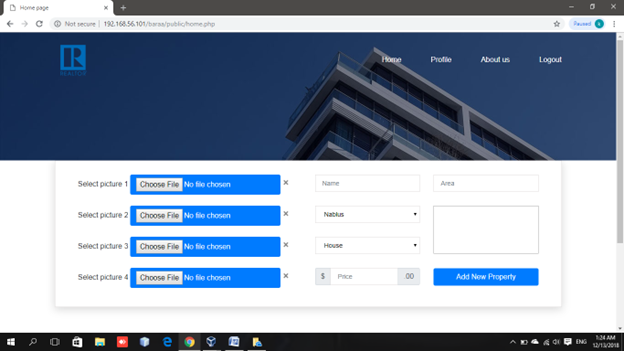
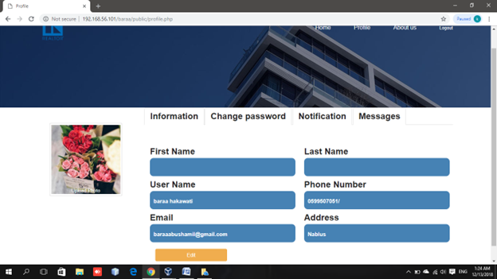

# REAL TOR 🏡💻

A full-stack web application designed to modernize and simplify the property buying and selling process in Palestine.

---

## 📌 Project Summary

**REAL TOR** is a graduation project developed to address the inefficiencies in the real estate market using a user-centric web platform. It allows buyers and sellers to interact, list properties, and communicate directly, reducing time, costs, and reliance on brokers.

---

## 📈 Key Features

- 🔐 **User Authentication**  
  Secure login system for both buyers and sellers.

- 🏘️ **Property Listings**  
  Sellers can add, edit, and delete properties with detailed descriptions and images.

- 📩 **Messaging System**  
  Direct chat functionality between buyer and seller through the platform.

- 🔔 **Activity Alerts**  
  Real-time notifications for interested buyers and active sellers.

- 🔍 **Advanced Search**  
  Filter properties by location, type, price, and specifications.

- 📊 **Database Integration**  
  Efficient, normalized schema using MySQL to handle user and property data.

---

## 💡 Problem Solved

Traditional real estate transactions in Palestine are plagued by:
- Wasted time through in-person inquiries and phone calls.
- High broker fees and advertisement costs.
- Poor access to structured property data.

**REAL TOR** solves this by centralizing listings, communication, and alerts in one secure platform.

---

## 🛠️ Technologies Used

| Frontend       | Backend       | Database     | Other Tools        |
|----------------|---------------|--------------|---------------------|
| HTML5, CSS3    | PHP           | MySQL        | Bootstrap           |
| JavaScript     | AJAX, jQuery  | phpMyAdmin   | Brackets IDE        |

---

## 👥 System Users

- **Sellers**
  - Add, update, delete property listings
  - View interested buyers
  - Send/receive messages
  - Update profile

- **Buyers**
  - Search for properties
  - Mark interest
  - Communicate with sellers
  - Update profile

---

## 🧱 Database Design

- Unified **users** table with a role flag (`0 = seller`, `1 = buyer`)
- Direct relationship between `users` and `properties`
- Tables: `users`, `properties`, `messages`, `alerts`, etc.

---

## 🗺️ Future Enhancements

- 📍 Integration of **GPS & GIS**
- 🌐 **Multi-language support** (Arabic)
- 🤖 **AI-based recommendations** for property matches
- 📱 Native mobile apps (Android, iOS, Windows)
- 🔎 Smart search filters and improved UX

---

## 📷 Snapshots

- **Login Page**
  

- **Registration Page**
  

- **Offering Page**
  

- **Searching Panel**
  

- **Profile Page**
  

---

## ✅ Conclusion

REAL TOR provides a modern solution to a deeply traditional industry. With streamlined communication, automated alerts, and a user-friendly interface, it empowers both buyers and sellers to conduct real estate transactions with ease, speed, and trust.

---

## 📬 Contact

**Developer**: Baraa A. Hakawati  
**Institution**: An-Najah National University – MIS, Engineering & IT  
📍 Nablus, Palestine

---

